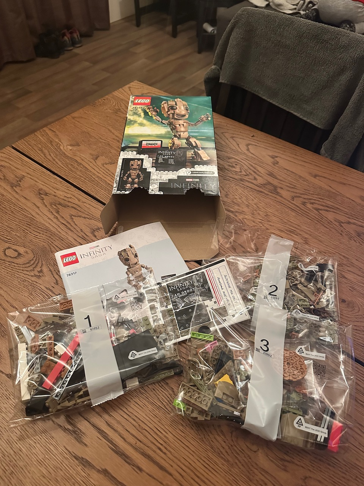
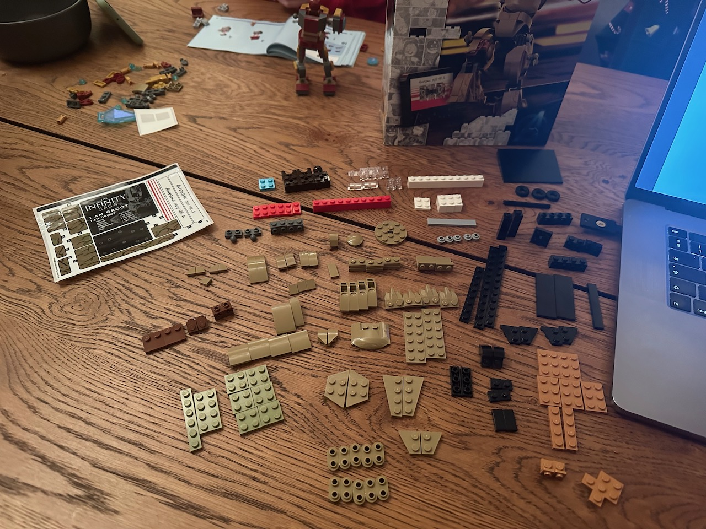
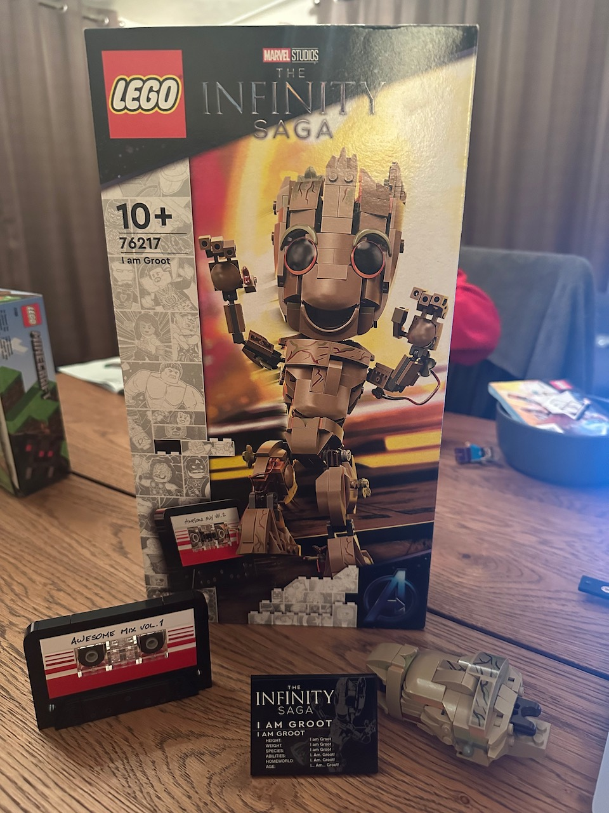
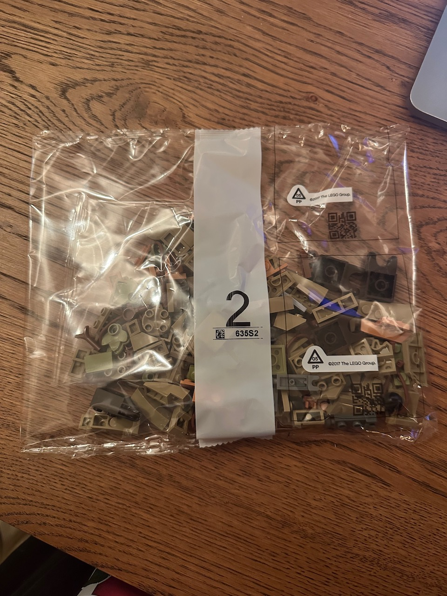
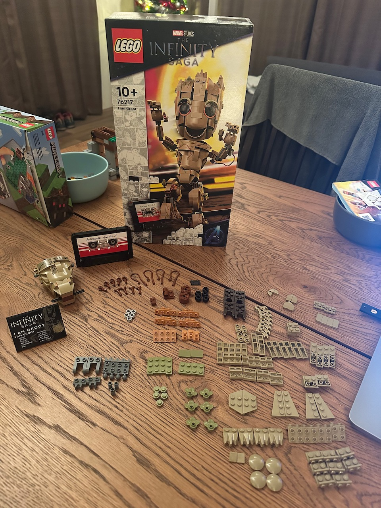
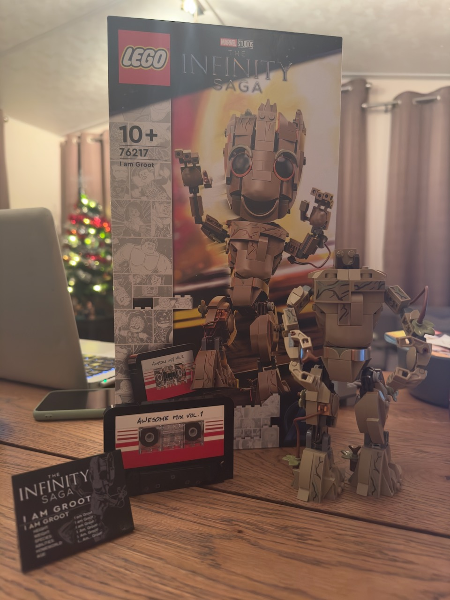
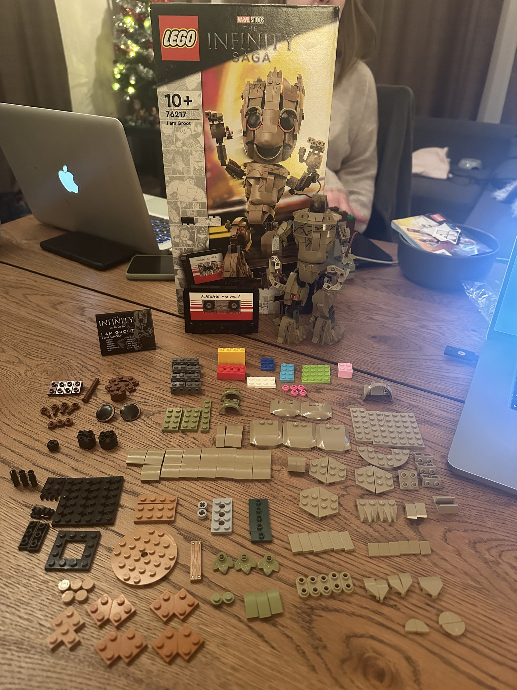
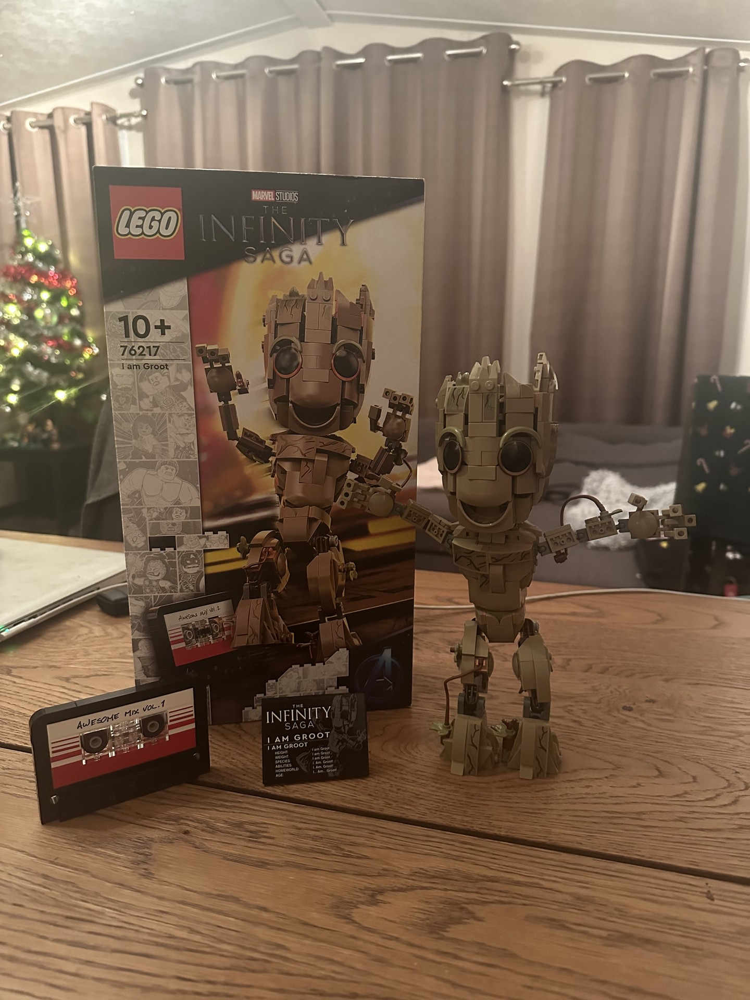

# Contact
* Email: [j1g54w_31337@proton.me](mailto:j1g54w_31337@proton.me)
* Github: [https://github.com/j1g54w1337](https://github.com/j1g54w1337)
* Twitter: [https://twitter.com/j1g54w_31337](https://twitter.com/j1g54w_31337)

# Building the LEGO Marvel set 76217: I am Groot
As a fan of both LEGO and the Marvel franchise, I was excited to receive the I am Groot set, number 76217 as a gift on the second day of Christmas, December 26th 2022. This set, based on the beloved character from the Guardians of the Galaxy series, promised to be a fun and challenging build. In this post, I'll be sharing my experience building the set, including the ups and downs, as well as a detailed description of the build process and the finished model.

## The Set

The I am Groot set, number 76217, is a medium-sized set, containing **476** pieces. The finished model measures 18.9 cm high, 35.3 cm long, and 7.3 cm wide. The set comes with a detailed instruction manual that guides the builder through the building process step by step.

## Building Experience

I have to say, this was a very nice build which was not too hard. However, I did make a mistake early on in the build that resulted in the demolition of nearly the whole first phase of the build. But, I didn't let it stress me out, I just started over and had even more building joy as a result!

The first thing I noticed when I opened the box was the variety of pieces included in the set. The set comes with a mix of standard bricks in various sizes, as well as some specialized pieces like the printed brick and the leaves that make up Groot's body. The instruction manual is well-organized and easy to follow, making it easy to keep track of what pieces to use and where they go.

One aspect of the build that I wasn't a fan of was the stickers. I really hate applying stickers to LEGO sets, but it's a small price to pay for the finished product. Another strange thing that I noticed was that there was only one brick that was printed, which was a bit odd. I would have preferred if they had printed all of the bricks, or none at all. But, I'm sure there was a reason for it.

The build process itself was enjoyable and not too difficult. The set is divided into several phases, each building on the previous one. This made it easy to keep track of my progress and see the finished model taking shape. The most challenging part of the build was probably the assembly of Groot's body, which required careful placement of the leaves to achieve the desired shape. But, with a bit of patience and attention to detail, I was able to get it right.

Once the build was complete, I was really impressed with the finished model. The attention to detail is impressive, and the finished model looks just like Groot from the Guardians of the Galaxy movies. The model is sturdy and well-built, and I have no doubt that it will hold up well over time.

I really enjoyed building this set, and I'm glad I was able to do it on the second day of Christmas, December 26th, 2022. It made for a great way to spend my holiday and I'm sure it will hold a special place in my collection.

## Conclusion

Overall, I had a great time building the I am Groot set. The finished model is impressive and will make a great addition to any collection. Even if the build itself may not be to your liking, the love for Groot is undeniable and makes it an instant buy for many. As I mentioned, it was a gift from a loved one, making it an even more special addition to my collection. I can definitely recommend this build to anyone looking for a fun and satisfying building experience. The set is a great mix of challenging and satisfying, and the finished model is both beautiful and sturdy. If you're a fan of the Marvel franchise, or just looking for a fun building experience, this set is definitely worth checking out. Building it on a special day like the second day of Christmas, made it even more memorable.

## Build images

